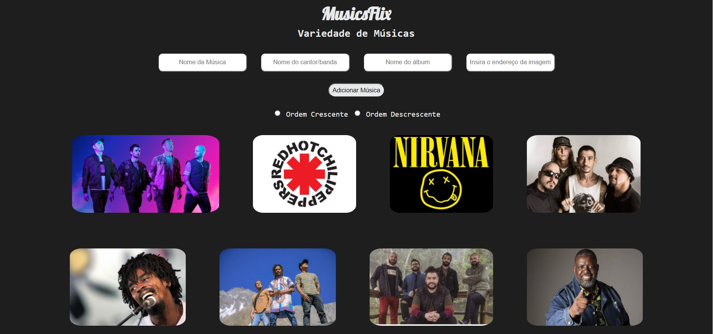
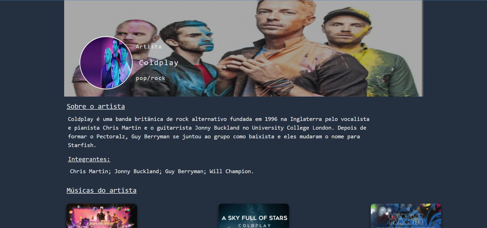

### **MusicsFlix** 

### Um [site](https://musicsflix.netlify.app/) que contém as músicas de variados artistas e foi inspirado no [Musicxmatch](https://www.musixmatch.com/pt-br).

##

1. Objetivos do projeto  
O objetivo do projeto é treinar como adicionar fotos, texto, links em uma página Html com JavaScript e estilizando ela com CSS

2. Página inicial  
 

2.1 Página do cantor  
 

3. Para fazer:
* Adicionar o restante das músicas.

4. Tecnologias usadas : 
*  
*  
*  
